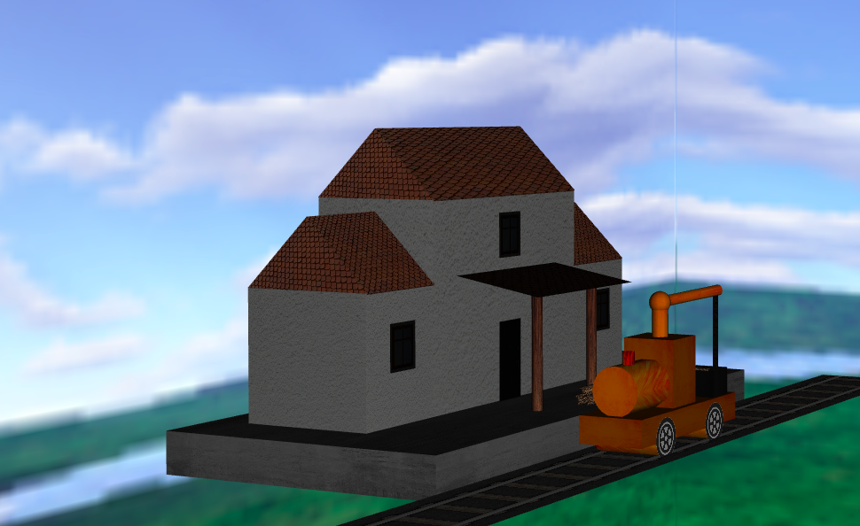

# CGRA 2021/2022

## Group T07G03

| Name             | Number    | E-Mail               |
| ---------------- | --------- | -------------------- |
| Henrique Pinho   | 201805000 | up201805000@fc.up.pt |
| Bruna Ribeiro    | 201804925 | up201804925@fc.up.pt |

## Project Notes

- In exercise 4 we had some dificulties to put the train moving at different speeds
- In exercise 5.4 we took a long time to think of a way to make the crane handle the wood
- We did the "Wheel animation depending on speed", point one of the valuation features

- Carris

- circulo

- cilindro

- globo

- locomotiva

- cubemap

- guindaste

- locomotiva com textura

- estacao

- terreno

- rodas a mover
