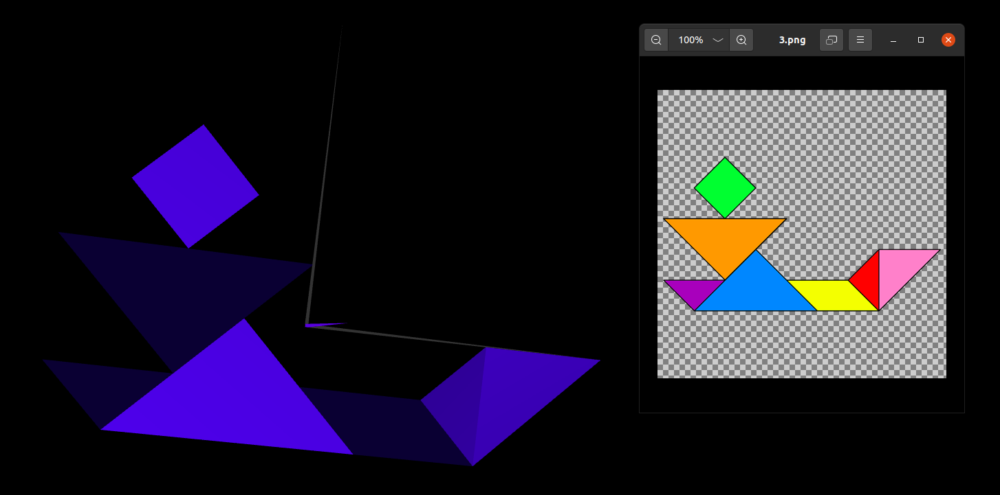
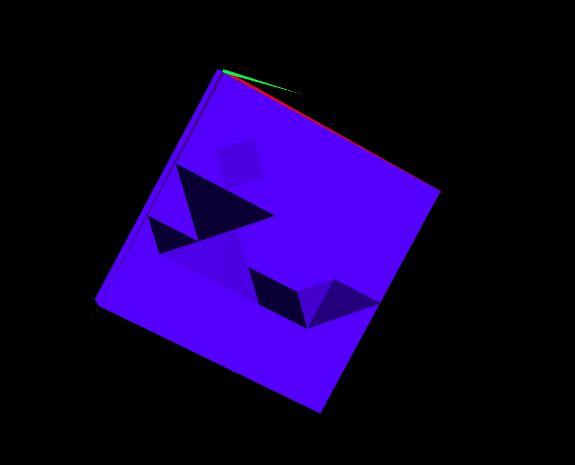
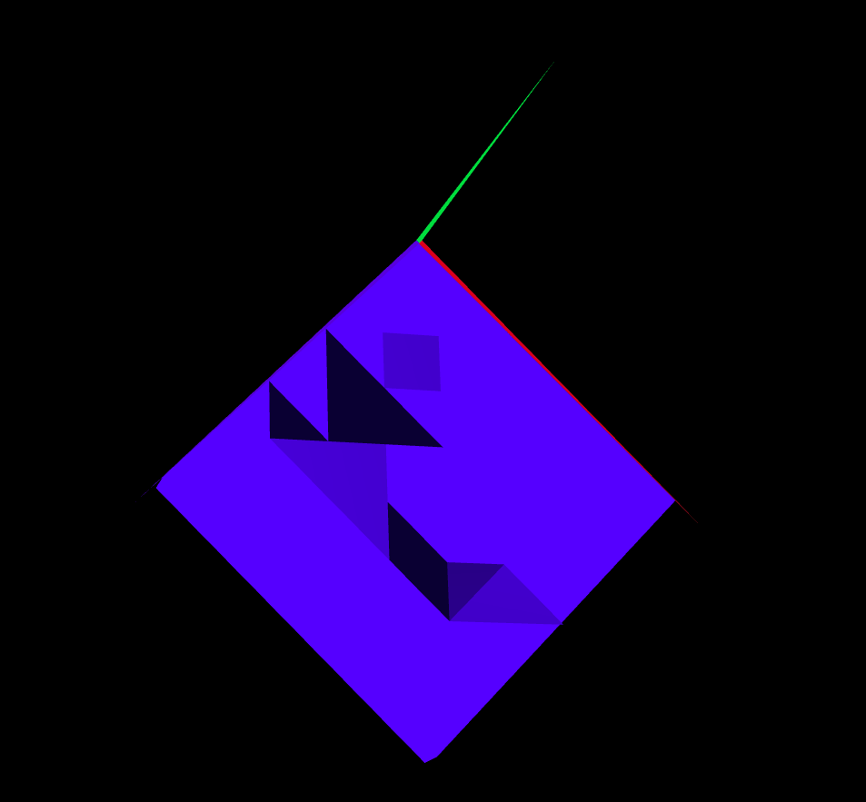

# CGRA 2021/2022

## Group T07G03

## TP 1 Notes

- In exercise 2, we found it difficult to understand the best way to manipulate the figures but when understood, the exercise was very interesting.
- In exercise 3, our difficulty was on understanding which transitions to apply to both figures in order to create the frame.
- In exercise 4, we found it difficult to understand how to manipulate the faces individually.

