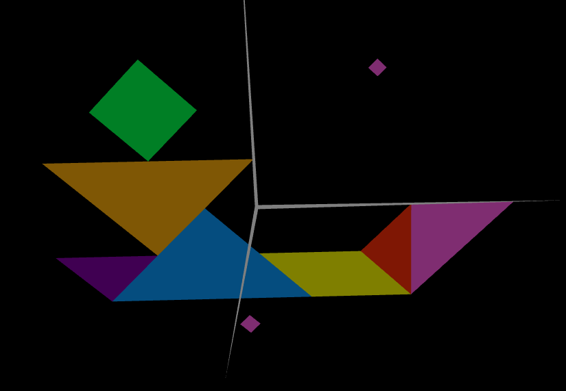

# CGRA 2021/2022

## Group T07G03

## TP 3 Notes

In this exercise we initially had some troubles in how to create more than one normal to the same vertice but once we understood how, the exercise was interesting. 

